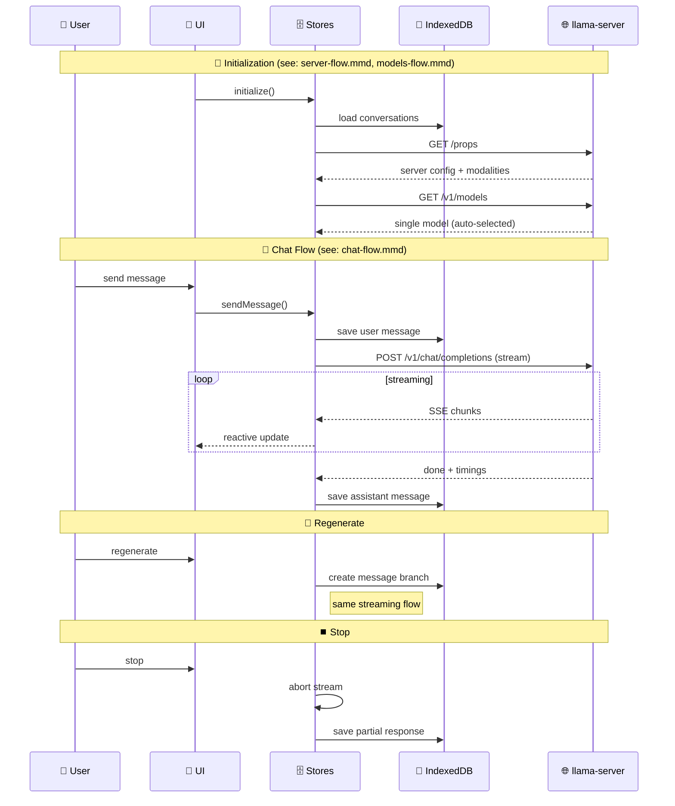

// ============================================================================
// 文件: data-flow-simplified-model-mode.md
// 路径: /Users/lzp/Library/Mobile Documents/com~apple~CloudDocs/workspace/llama.cpp/tools/server/webui/docs/flows/data-flow-simplified-model-mode.md
// 作者: 自动注释工具
// 描述: 工具文件,包含各种实用工具
// ============================================================================

